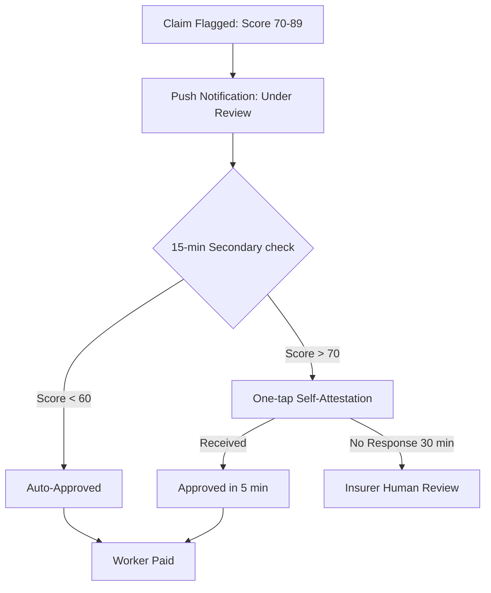

# Untitled Threats

### *AI-powered parametric income protection for Q-Commerce delivery partners*

---

## Table of Contents
1. [Problem Statement](#1-problem-statement)
2. [Persona & Scenarios](#2-persona--scenarios)
3. [Application Workflow](#3-application-workflow)
4. [Weekly Premium Model](#4-weekly-premium-model)
5. [Parametric Triggers](#5-parametric-triggers)
6. [AI/ML Integration Plans](#6-aiml-integration-plans)
7. [Adversarial Defense & Anti-Spoofing Strategy](#7-adversarial-defense--anti-spoofing-strategy)
8. [Advanced Anti-Spoofing & Coordinated Syndicate Defense](#8-advanced-anti-spoofing--coordinated-syndicate-defense)
9. [Tech Stack](#9-tech-stack)
10. [6-Week Development Plan](#10-6-week-development-plan)
11. [Repository Structure](#11-repository-structure)
12. [Regulatory Positioning](#12-regulatory-positioning)
13. [Current Working Features & Implemented Modules](#13-current-working-features--implemented-modules)
14. [Pitch Deck](#pitch-deck)


---

## 1. Problem Statement
 
Zepto and Blinkit delivery partners complete **8–15 deliveries per day**, earning roughly **₹600–900/day** from a volatile mix of base pay and per-delivery incentives. When external disruptions hit — a sudden cloudburst, a Red AQI alert, or an unannounced local curfew — they cannot step outside. Every idle hour is income gone forever.
 
**No existing insurance product covers income loss for gig workers.** Health plans cover hospitalisation. Motor policies cover vehicle damage. But the ₹350 lost on a rainy Tuesday afternoon? That loss is invisible to the entire insurance industry. The Platform is built exclusively for that gap: protecting the weekly earnings of Q-Commerce delivery partners against uncontrollable, verifiable external disruptions — nothing more, nothing less. Payouts are **fixed per event type**, not calculated from individual income estimates. This makes The Platform genuinely parametric: the payout is determined entirely by whether the external condition occurred, not by what any individual worker claims to have lost.
 
---
 
## 2. Persona & Scenarios
 
### Delivery Partner Profile
 
| Attribute | Detail |
|---|---|
| **Platform** | Zepto / Blinkit (Q-Commerce / Grocery) |
| **Daily deliveries** | 8–15 orders/day |
| **Daily earnings** | ₹600–900 (base + per-drop incentive) |
| **Working hours** | Typically 7 AM – 10 PM, 5–6 days/week |
| **Primary city zones** | Dense urban residential/commercial corridors |
| **Payment cycle** | Weekly (every Monday) |
| **Device** | Android smartphone; intermittent data connectivity |
 
---
 
### Scenario Table
 
| # | Event & Location | Context | Parametric Trigger | Fixed Payout | Platform Response |
|---|---|---|---|---|---|
| **1** | Mumbai Monsoon | Delivery partner parks bike at hub, roads impassable for 90+ min | Rainfall > 35 mm/hr sustained ≥ 90 min (OpenWeatherMap) | **₹350** | Auto-triggered on threshold; UPI transfer within 10 min. |
| **2** | Delhi AQI Emergency | GRAP Stage IV invoked; platforms throttle assignments city-wide | AQI > 400 sustained ≥ 3 hrs (AQICN API) | **₹500** | Full-tier payout auto-initiated; worker notified via app. |
| **3** | Bengaluru Curfew | Section 144 declared in partner's delivery zone | Geo-fenced curfew alert active in zone | **₹800** | Geo-verified auto-claim; 15-min fraud validation window. |
| **4** | Extreme Heat Day | Temp > 42°C; Zepto pauses outdoor assignments | Temperature > 42°C sustained ≥ 2 hrs (OpenWeatherMap) | **₹200** | Fixed-tier payout triggered; no manual calculation needed. |
| **5** | Hyderabad Flood | IMD Red alert; arterial roads waterlogged | IMD Red flood alert for district | **₹800** | Full-tier payout; duplicate-claim guard active in zone. |
 
---
 
## 3. Application Workflow
 
```
┌─────────────────────────────────────────────────────────────────────────┐
│  ONBOARDING                                                             │
│                                                                         │
│  Worker downloads app / opens web PWA                                   │
│       ↓                                                                 │
│  Registers with: Zepto/Blinkit partner ID + Aadhaar OTP + bank/UPI ID   │
│       ↓                                                                 │
│  AI Risk Profiler runs:                                                 │
│    • Zone flood/AQI/heat historical score (1–10)                        │
│    • Avg weekly active hours (from platform API / self-declared)        │
│    • Seasonal risk multiplier                                           │
│       ↓                                                                 │
│  Weekly Policy Created → Premium shown → Worker activates coverage      │
└──────────────────────────┬──────────────────────────────────────────────┘
                           │
                           ▼
┌─────────────────────────────────────────────────────────────────────────┐
│  LIVE MONITORING (runs 24×7 in background)                              │
│                                                                         │
│  Weather / AQI / IMD / Curfew APIs polled every 15 minutes              │
│       ↓                                                                 │
│  Parametric threshold crossed?                                          │
│    NO  → Continue monitoring                                            │
│    YES → Cross-check: is the worker's registered zone affected?         │
└──────────────────────────┬──────────────────────────────────────────────┘
                           │
                           ▼
┌─────────────────────────────────────────────────────────────────────────┐
│  CLAIM INITIATION (zero-touch by default; minimal-touch if flagged)     │
│                                                                         │
│  Fraud & Anti-Spoofing Engine runs (see Section 7)                      │
│  Uses: The Platform app motion data + network transitions + claim history  │
│  (Platform API used if available; Platform-native signals if not)      │
│       ↓                                                                 │
│  Claim status:                                                          │
│    ✅ APPROVED (majority) → Payout via UPI/Razorpay within 10 min       │
│    🔶 FLAGGED  → Soft hold; worker notified; 15-min secondary check     │
│                  → If still flagged: one-tap attestation pushed         │
│                  → No claim denied without human review option          │
│    ❌ REJECTED → Worker notified with plain-language reason + appeal    │
└──────────────────────────┬──────────────────────────────────────────────┘
                           │
                           ▼
┌─────────────────────────────────────────────────────────────────────────┐
│  POST-PAYOUT                                                            │
│                                                                         │
│  Worker dashboard updated: earnings protected this week                 │
│  Insurer dashboard updated: loss ratio, claims map, fraud flags         │
│  Weekly premium recalculated for next policy cycle                      │
└─────────────────────────────────────────────────────────────────────────┘
```
 
---
 
## 4. Weekly Premium Model
 
### Philosophy
Gig workers think in weeks, not months. Their income is volatile and their savings are thin. A weekly subscription model — auto-renewed every Monday — matches the rhythm of how Zepto/Blinkit pays its partners. There are no annual commitments, no renewal anxiety, and no wasted premium during weeks a partner is inactive.
 
### Adverse Selection Controls
A pure weekly opt-in model would be exploited immediately — workers would buy coverage only when a storm is already forecast. The Platform prevents this with three structural controls:
 
| Control | Mechanism |
|---|---|
| **Minimum enrollment period** | Workers must hold a policy for at least 2 consecutive weeks before any claim is eligible. No same-week coverage. |
| **Enrollment freeze window** | Once a parametric trigger event is forecast (e.g. IMD issues a warning 24 hrs ahead), new enrollments for that event type are locked for 48 hours. |
| **Claim frequency cap** | Maximum 2 paid claims per worker per 4-week rolling window. Prevents workers gaming repeated short-duration events. |
 
These controls are standard in parametric microinsurance design and ensure the premium pool remains viable without penalising workers who stay enrolled consistently.
 
### Base Premium Bands
 
| Worker Profile | Weekly Premium | Max Weekly Payout |
|---|---|---|
| Low-risk zone, 5 days/week, < 40 hrs | ₹39 | ₹1,200 |
| Medium-risk zone, 5 days/week | ₹59 | ₹1,800 |
| High-risk zone (flood/AQI-prone), 6 days/week | ₹79 | ₹2,500 |
| High-risk zone, heavy-hour worker (> 55 hrs/week) | ₹99 | ₹3,000 |
 
### AI Dynamic Adjustment Factors
 
The ML pricing model adjusts from the base band using the following signals:
 
| Signal | Adjustment |
|---|---|
| Zone historical disruption score (0–10) | ±₹10 to ±₹25 |
| Seasonal risk (monsoon Jun–Sep, smog Nov–Jan) | +₹5 to +₹15 |
| Worker's personal claim history (low = discount) | −₹5 to −₹10 |
| Platform-verified delivery consistency | Loyalty discount up to −₹8 |
 
### Payout Schedule — Fixed Parametric Tiers
 
Payouts are **predefined per event type and duration — no income estimation, no self-declaration, no adjuster required.** The moment the API confirms a threshold is crossed in the worker's zone, the payout amount is already known. There is nothing to calculate at claim time.
 
| Event Type | Duration Threshold | Fixed Payout | Behavioral Basis |
|---|---|---|---|
| Heavy Rain (> 35 mm/hr) | ≥ 60 min | ₹200 | Rainfall > 35 mm/hr reduces urban delivery order completion rates by ~40–50%; short disruption, partial shift lost |
| Heavy Rain (> 35 mm/hr) | ≥ 90 min | ₹350 | Sustained heavy rain effectively halts outdoor Q-Commerce operations; 3–4 hr income window lost |
| Extreme Heat (> 42°C) | ≥ 2 hrs | ₹200 | Platforms including Zepto have documented voluntary worker withdrawal above 42°C; afternoon peak hours lost |
| Severe AQI (> 400) | ≥ 3 hrs | ₹500 | AQI > 400 (Severe+) triggers GRAP Stage IV restrictions; platforms throttle outdoor assignments and workers self-withdraw due to health risk — near full-day income impact |
| Flash Flood — IMD Red Alert | Alert active | ₹800 | Red flood alerts render arterial roads impassable; full working day lost across affected district |
| Curfew / Section 144 | Active in zone | ₹800 | Legal prohibition on movement; 100% income loss for duration; geo-fenced to affected zone only |
 
> **Why these numbers?** The ₹200–₹800 range is anchored to the average Zepto/Blinkit partner earning ₹600–900/day (₹75–112/hr). Tiers are set to cover 2–8 hours of lost earnings depending on event severity — calibrated to be meaningful to the worker without making the product unviable to price. No worker input required at any point.
 
---
 
## 5. Parametric Triggers
 
All triggers are **automatic, objective, and verifiable** using third-party APIs. Workers never need to file a claim manually. Every threshold is grounded in documented delivery network behavior — we are not guessing at what disrupts work, we are encoding what already demonstrably does.
 
| # | Trigger | Data Source | Threshold | Min Duration | Fixed Payout | Behavioral Grounding |
|---|---|---|---|---|---|---|
| 1 | **Heavy Rain** | OpenWeatherMap API | > 35 mm/hr | 60 min | ₹200 | Rainfall > 35 mm/hr reduces urban delivery order completion by ~40–50%; riders report halting operations at this level |
| 2 | **Heavy Rain (sustained)** | OpenWeatherMap API | > 35 mm/hr | 90 min | ₹350 | Sustained rain at this intensity floods feeder lanes and access roads in most Tier-1 cities; Q-Commerce hubs go dark |
| 3 | **Extreme Heat** | OpenWeatherMap API | > 42°C | 2 hrs | ₹200 | Above 42°C, platforms including Zepto have documented worker self-withdrawal; 2-hr afternoon peak window lost |
| 4 | **Severe AQI** | AQICN / OpenAQ API | AQI > 400 | 3 hrs | ₹500 | AQI > 400 triggers GRAP Stage IV; platforms throttle outdoor assignments and workers self-withdraw — near full-day impact documented in Delhi/NCR winters |
| 5 | **Flash Flood Alert** | IMD API / mock feed | Red alert issued | Alert active | ₹800 | IMD Red flood alerts correlate with complete arterial road closure in affected districts; historical data shows ~0 delivery completions during active alerts |
| 6 | **Curfew / Section 144** | Govt advisory mock API | Curfew in active zone | Active | ₹800 | Legal prohibition on movement; platforms suspend operations in curfew zones automatically; 100% income loss |
 
> **On trigger thresholds and actual work stoppage:** A valid concern is that workers sometimes continue operating through adverse conditions — platforms don't always halt, and individual risk tolerance varies. The Platform's thresholds are set at levels where *platform-level* stoppage is documented or worker withdrawal becomes statistically dominant, not at levels where work merely becomes uncomfortable. The 35 mm/hr rain threshold, for instance, corresponds to conditions where urban road flooding begins in most Tier-1 Indian cities — at that point it is not a choice to stop, it is a physical constraint. Thresholds are reviewed against IMD and platform operational data quarterly.
 
---
 
## 6. AI/ML Integration Plans
 
### 6.1 Dynamic Pricing Engine
- **Model type:** Gradient Boosted Trees (XGBoost / scikit-learn)
- **Training data:** IMD historical weather records, AQICN historical AQI data, NDMA flood event logs, synthetic disruption-frequency data per pin code
- **Features:** Zone risk score, season, worker active hours, historical claim frequency, city-level disruption calendar
- **Output:** Adjusted weekly premium per worker; recalculated every Sunday night for the upcoming week
- **Approach:** The model outputs a continuous premium multiplier (0.7× to 2.0×) applied to the base band. Premiums are capped to ensure affordability (max ₹99/week in Phase 1).
 
### 6.2 Fraud Detection Engine
 
**Phased complexity — what we build when:**
 
| Signal | Phase 1 (MVP) | Phase 3 (Full) |
|---|---|---|
| Claim frequency anomaly | ✅ Simple rule: > 2 claims/4 weeks flagged | ✅ ML baseline per worker |
| App motion (accelerometer) | ✅ Basic: stationary vs active binary | ✅ Full behavioral biometric profile |
| Network transitions | ✅ Home Wi-Fi lock detection | ✅ Cell tower clustering |
| GPS metadata forensics | ❌ Not in Phase 1 | ✅ Spoofing artifact detection |
| Syndicate/network clustering | ❌ Not in Phase 1 | ✅ IP subnet + referral graph |
 
Phase 1 fraud detection is intentionally lightweight — rule-based checks on claim frequency and basic motion signals. This is honest about what is provable at MVP stage. The sophisticated behavioral biometric and syndicate detection layers described in Section 7 are the Phase 3 target architecture, not Phase 1 claims.
 
- **Model type (Phase 3):** Isolation Forest trained on legitimate claim patterns
- **Output:** Fraud risk score (0–100); above 70 = soft hold; above 90 = auto-reject pending review
 
### 6.3 Risk Profiling
- **Zone risk score (1–10):** Computed per pin code using 3 years of historical weather, AQI, and flood event frequency data. Updated quarterly.
- **Worker risk score (1–10):** Composite of zone score, platform tenure, and claim history. Used for premium calculation and fraud baseline.
- **Seasonal adjustment:** The model automatically applies monsoon-season upweights (June–September) and smog-season upweights (November–January) for relevant cities.
 
---
 
## 7. Adversarial Defense & Anti-Spoofing Strategy
 
> **Context:** A coordinated fraud syndicate used GPS-spoofing apps to fake location inside a weather-affected zone while resting at home, draining a competitor platform's liquidity pool. The Platform's architecture is designed from the ground up to defeat this class of attack.
 
---
 
### 7.1 The Differentiation — How We Tell a Genuine Claim from a Spoof
 
GPS coordinates alone are worthless as a fraud signal — they are trivially spoofed. The Platform does not use raw GPS as a primary trust indicator. Instead, we build a **behavioral fingerprint** for each worker using a multi-signal cross-validation stack:
 
**Signal Layer 1 — Platform App Activity (Primary Signal, with fallback)**
The strongest fraud signal is whether the worker was actually online on Zepto/Blinkit when the disruption hit. The Platform pursues this via two routes depending on partnership status:
 
- **With platform API access (target state):** Direct query of worker's online/offline status and recent delivery assignments in the 2-hour pre-disruption window. A worker offline on platform = no legitimate claim.
- **Without platform API (Phase 1 / fallback):** The Platform's own app tracks session activity passively. If the worker had The Platform app open and showed active motion (see Layer 2), this substitutes as a proxy for work-readiness. This is a weaker signal — acknowledged — but sufficient for MVP fraud detection combined with Layers 2 and 3.
 
> **Platform dependency is a known business risk.** Formal API access from Zepto/Blinkit requires partnership agreements that do not exist at prototype stage. Phase 1 operates entirely on Platform-native signals. Platform API integration is a Phase 3 business milestone, not a technical one.
 
**Signal Layer 2 — Behavioral Biometric Consistency**
The mobile app passively collects:
- **Accelerometer/gyroscope data:** A delivery partner on a bike shows high, irregular motion signatures. Someone lying on a sofa at home shows flat, low-variance motion. We compare the motion profile from the 2 hours before the disruption claim against the worker's historical on-shift motion baseline. Stationary motion during a claimed active-shift period is a hard red flag.
- **Battery/charging state:** Workers on shift tend to be on battery; workers at home tend to be plugged in. A consistently charging phone during "active delivery hours" is a soft flag.
- **Network transitions:** A working partner moves between cell towers. A stationary fraudster stays connected to the same home Wi-Fi router. We log SSID transitions (not the SSID itself, for privacy) — a worker with zero network transitions during a 4-hour "active" window is flagged.
 
**Signal Layer 3 — Temporal Activity Patterns**
Every worker builds a historical activity profile: typical login times, average delivery zones, average session duration. A claim filed for a time slot that falls completely outside a worker's established active hours (e.g., claiming income loss at 11 PM for a worker who never works past 8 PM) is automatically flagged for review.
 
---
 
### 7.2 The Data — Detecting a Coordinated Fraud Ring
 
A single spoofed claim might slip through. A ring of 50+ spoofed claims from the same event should not. The Platform detects coordinated rings using:
 
| Data Point | How It Catches a Ring |
|---|---|
| **Claim velocity per event** | If a single weather event generates 3× more claims than any comparable historical event in that city, an automated alert fires for insurer review |
| **Device fingerprint clustering** | Claims from devices sharing the same hardware fingerprint, IMEI prefix pattern, or having the same GPS spoofing app signature (detected by anomaly in GPS metadata — spoofing apps often produce implausibly smooth or perfectly grid-aligned coordinate sequences) are clustered and flagged together |
| **Network origin clustering** | If 40 claims come from IP addresses within the same /24 subnet in a single evening, that is a syndicate signal — legitimate workers spread across a city use diverse ISPs and cell towers |
| **Social graph analysis** | The Platform monitors (with consent, disclosed in ToS) whether multiple flagged workers share Telegram group membership signals via referral codes. Workers who joined through the same referral link and file claims in the same event window are scored as correlated risk |
| **GPS metadata forensics** | Legitimate GPS traces from a phone in a city show natural jitter (±3–8 metres), slight altitude variation, and irregular sampling intervals. Spoofed GPS from common apps produces implausibly smooth paths, zero altitude variation, and perfectly regular 1-second samples. We parse the raw GPS metadata, not just the coordinate pair |
| **Claim-to-active-hours ratio** | A worker claiming 6 hours of lost income but whose platform app shows only 45 minutes of active status that day is internally inconsistent. This mismatch is scored heavily |
 
---
 
### 7.3 The UX Balance — Protecting Honest Workers Flagged During Bad Weather
 
This is the hardest design challenge. Heavy rain causes genuine GPS drift, cell tower congestion, and app connectivity issues — exactly the conditions that might make an honest worker look like a fraudster to a naive system. The Platform's design is **innocent until proven guilty**, with friction minimized for genuine workers.
 
**The Soft-Hold Workflow (for flagged claims):**
 


```
Claim flagged (fraud score 70–89)
       ↓
Worker receives a push notification:
  "Your claim for [Event Name] is being reviewed.
   You'll receive a decision in 15 minutes.
   No action needed unless we reach out."
       ↓
Automated secondary check runs:
  • Pull last 30-min platform activity log
  • Check if disruption is confirmed in peer claims from nearby workers
    (if 3+ nearby workers have clean claims approved, social proof weight
     added to this worker's score → likely legitimate)
  • Re-score: If fraud score drops below 60 → auto-approved
       ↓
Still above 70 after 15 min?
  → One-tap self-attestation pushed to worker:
    "Confirm you were working in [Zone] during this event"
    + Optional: 1-photo upload (shows surroundings, not face) for context
       ↓
Self-attestation received → Claim approved within 5 min
No response in 30 min → Claim held; insurer human reviewer assigned
```
 
**Key UX Principles for Honest Workers:**
1. **No upfront burden.** Workers never fill claim forms. The process is automatic. Flagging only triggers passive notifications, never demands.
2. **The 15-minute rule.** No legitimate claim is denied without at least a 15-minute secondary review window. Speed is not sacrificed for caution.
3. **Social proof as a trust accelerator.** If workers in the same zone with clean profiles are being paid, a flagged worker in the same zone benefits from that corroborating evidence — their score is adjusted upward automatically.
4. **Plain-language notifications.** All flag messages are written in simple Hindi/English, explaining what is being checked — not corporate jargon.
5. **Appeals are built-in.** Every denied claim includes a one-tap "I disagree" button that routes to a human reviewer within 24 hours. Wrongful denials are corrected, and worker trust scores are restored.
6. **Network drop protection.** If a worker's device loses signal during the disruption window (which is expected in a flood or storm), the system treats this as corroborating evidence of being in the affected zone, not as a suspicious anomaly.
 
---
 
## 8. Advanced Anti-Spoofing & Coordinated Syndicate Defense

### 8.1 Innovative Differentiation (Low-Cost Signals)

To further strengthen the "airtight" nature of the defense, The Platform integrates environmental signals that are difficult to spoof without physical presence:

- **Rain/Flood**: 
    - **Audio fingerprints**: Capturing the specific frequency "Sound of Rain" (300Hz–3kHz peak) via the device microphone.
    - **Signal-to-Noise attenuation**: Measuring GPS signal degradation caused by atmospheric moisture and cloud cover.
    - **Barometer drops**: Verification via hardware barometric sensors present in most mid-to-high-end Android devices.
- **Extreme Heat**: 
    - **Battery thermal dissipation**: Monitoring the rate of battery temperature increase/decrease against ambient temperature baselines.
    - **CPU throttling logs**: Cross-referencing CPU performance drops typical of hardware operating in 42°C+ heat.
- **Severe AQI**: 
    - **Ambient light (Lux) haze**: Detection of reduced light intensity and specific scattering patterns using the phone's ambient light sensor.
    - **Radio particle scattering**: Identifying subtle shifts in Wi-Fi/Bluetooth signal strength due to high particulate matter (PM2.5/PM10).
- **Curfew**: 
    - **SSID density "Silence"**: Detecting a significant reduction in transient mobile hotspots (SSIDs) in a zone, corroborating a lack of public movement.
    - **Cell Tower handover frequency**: Identifying a shift from high-frequency handovers (moving) to "cluster-locked" behavior (stationary/patrolling) in specific geo-fenced zones.
- **General (All Scenarios)**: 
    - **GPS Multi-Path Jitter**: Identifying the lack of natural signal jitter in "too-perfect" spoofed coordinate sequences.
    - **Fleet Proximity Mesh**: Using BLE (Bluetooth Low Energy) pings between active partners in the same zone to corroborate physical presence.

### 8.2 Advanced Syndicate Response (500+ Scale)

For large-scale coordinated attacks (e.g., a 500-partner fraud ring), The Platform employs structural financial and behavioral guards:

- **Liquidity Circuit Breaker**: An automated "Flash-Lock" on payouts that triggers if the velocity of claims in a specific zone or time window exceeds a dynamic threshold. This prevents a "run on the bank" by synthetic attackers.
- **Social Coordination Monitoring**: Identifying "payout gaming" patterns or coordinated login/logout events that suggest external orchestration (monitoring Telegram/Discord trends where possible).
- **Hardware Fingerprint Clustering**: Identifying 500+ devices sharing identical system properties, spoofing script artifacts, or kernel-level anomalies associated with bulk-emulated accounts.

### 8.3 Enhanced UX & Trust Strategy

- **The "Vouch" System**: Implementing a peer-to-peer verification layer where high-trust workers (clean history for 6+ months) can "vouch" for another worker's physical presence in a zone to bypass soft-holds.
- **Network Congestion Tolerance**: Explicitly treating dropped packets, high latency, and intermittent connectivity as corroborating evidence of a disaster zone (e.g., floods or storms) rather than suspicious activity.

---
 
## 9. Tech Stack
 
| Layer | Technology | Rationale |
|---|---|---|
| **Frontend** | React.js (PWA) | Works on low-end Android browsers; installable without Play Store |
| **Backend** | Python + FastAPI | Fast async I/O; ideal for API polling and ML model serving |
| **Database** | PostgreSQL (structured) + Redis (session/cache) | ACID compliance for financial records; Redis for real-time claim state |
| **AI/ML** | Python microservice — scikit-learn (pricing), Isolation Forest (fraud) | Lightweight, interpretable models suitable for Phase 1 |
| **Weather APIs** | OpenWeatherMap API (free tier), AQICN API | Real-time weather + AQI; both have free tiers sufficient for demo |
| **Flood/Curfew** | IMD API (mock in Phase 1), custom mock alert generator | Simulated parametric triggers for demo |
| **Payments** | Razorpay Test Mode / UPI simulator | Safe sandbox; realistic payout flow demonstration |
| **Auth** | Firebase Auth (OTP-based) | Aadhaar-linked mobile OTP; standard for Indian fintech |
| **Hosting** | Vercel (frontend) + Render (backend + ML service) | Free tiers sufficient for hackathon; zero DevOps overhead |
| **Monitoring** | Custom admin dashboard (React) | Loss ratio, claims map, fraud flags — built in Phase 3 |
 
---
 
## 10. 6-Week Development Plan
 
| Phase | Weeks | Theme | Key Deliverables |
|---|---|---|---|
| **Phase 1** | 1–2 | Ideate & Know Your Worker | README (this doc), persona research, application wireframes, tech stack decisions, 2-min strategy video |
| **Phase 2** | 3–4 | Protect Your Worker | Worker registration flow, risk profiling UI, weekly policy creation, dynamic premium calculator, 4–5 parametric trigger automations, zero-touch claim initiation, basic fraud scoring |
| **Phase 3** | 5–6 | Perfect Your Worker | Advanced fraud detection (GPS forensics, syndicate detection), Razorpay sandbox payout flow, worker dashboard (earnings protected, active coverage), insurer admin dashboard (loss ratio, claims map, predictive alerts), final demo video + pitch deck |
 
### Phase 2 Sprint Plan (Weeks 3–4)
 
| Week | Focus |
|---|---|
| Week 3 | Registration + onboarding flow; zone risk score computation; weekly premium calculator (rule-based v1) |
| Week 4 | Parametric trigger monitoring service (OpenWeatherMap + AQICN polling); claim auto-initiation engine; basic fraud score (v1: activity check + claim frequency); UPI mock payout |
 
### Phase 3 Sprint Plan (Weeks 5–6)
 
| Week | Focus |
|---|---|
| Week 5 | GPS metadata forensics; syndicate detection (network clustering); soft-hold UX flow; Razorpay test mode integration |
| Week 6 | Worker dashboard; insurer admin dashboard; end-to-end demo scripting; final pitch deck; video recording |
 
---
 
## 11. Repository Structure
 
```
Untitled Threats/
│
├── client/                  # React.js PWA (worker-facing)
│   ├── src/
│   │   ├── pages/           # Onboarding, Dashboard, Claims, Policy
│   │   ├── components/      # UI components
│   │   └── hooks/           # API hooks, state management
│   └── public/
│
├── server/                  # Python FastAPI backend
│   ├── api/
│   │   ├── auth.py          # Firebase OTP integration
│   │   ├── policy.py        # Policy creation & management
│   │   ├── claims.py        # Claim initiation & payout
│   │   └── triggers.py      # Parametric trigger monitoring
│   ├── services/
│   │   ├── weather.py       # OpenWeatherMap + AQICN polling
│   │   └── payments.py      # Razorpay sandbox integration
│   └── db/
│       └── models.py        # PostgreSQL schema (SQLAlchemy)
│
├── ml-service/              # Python ML microservice
│   ├── pricing_model.py     # XGBoost weekly premium calculator
│   ├── fraud_model.py       # Isolation Forest + behavioral scoring
│   ├── risk_profiler.py     # Zone & worker risk scoring
│   └── data/
│       └── zone_scores.csv  # Historical disruption data per pin code
│
├── mock-apis/               # Mock data generators
│   ├── imd_flood_mock.py    # Simulated IMD flood alerts
│   └── curfew_mock.py       # Simulated curfew/Section 144 alerts
│
├── docs/
│   ├── architecture.png     # System architecture diagram
│   ├── wireframes/          # UI wireframes
│   └── pitch-deck.pdf       # Final pitch deck (Phase 3)
│
├── .env.example             # Environment variable template
├── docker-compose.yml       # Local dev environment
└── README.md                # This document
```
 
---
 
## 12. Regulatory Positioning
 
Untitled Threats is designed to operate **in partnership with a licensed insurer**, not as a standalone insurance product. This distinction is intentional and non-negotiable.
 
### Why this matters
Offering income protection with automated weekly premiums and payouts constitutes insurance under Indian law and falls under IRDAI jurisdiction. An unlicensed platform cannot legally underwrite this product, regardless of how it is framed technically.
 
### How Untitled Threats is positioned
Untitled Threats is a **parametric trigger and disbursement platform** — the technology layer that handles:
- Real-time event monitoring and threshold detection
- Fraud scoring and claim validation logic
- Worker onboarding, UPI payout disbursement, and dashboard
 
The **underwriting risk is carried by a licensed insurer partner** (target: a microinsurance or general insurer with a gig-economy portfolio). Untitled Threats operates as a technology service provider / insurance distribution platform under the insurer's license — a model already established by players like Digit, Acko, and several IRDAI Sandbox-approved fintechs.
 
### Phase 1 stance
For the purposes of this prototype, Untitled Threats operates as a **proof-of-concept under IRDAI's Regulatory Sandbox** framework, which permits limited-scale testing of innovative insurance products without full licensing. Any production deployment requires a formal insurer partnership before launch.
 
---
 
 
 
| Category | Explicitly Not Covered |
|---|---|
| **Hardware** | Vehicle repairs, maintenance, or damage to delivery equipment. |
| **Health & Life** | Medical costs, hospitalization, disability, or life insurance. |
| **Income Basis** | Any claim requiring manual income estimation or self-declaration. |
 

## It covers **one thing only:** income lost due to verified external disruptions that prevent delivery work. That focus is the product's strength.

---

## 13. Current Working Features & Implemented Modules

Based on the recent integrations across the codebase, the following systems and features are fully functional:

- **Frontend Core & Client Dashboard**:
  - Real-time `EnvironmentMonitor` module functioning and displaying live triggers.
  - Payout Tracker flow accurately tracking and updating claim statuses.
  - Unified UI components (e.g., modern `Card.jsx` system) serving the dashboard.
- **Backend APIs & Routing Systems**:
  - Core service routes are live (`policy.routes.js`, `worker.routes.js`, `admin.routes.js`).
  - Active admin endpoints effectively supporting environment simulation (`simulateFraud`, `simulateRisk`, `simulatePremium`).
  - Real-time WhatsApp/notification integration for rapid worker alerts upon parametric zone triggers.
- **AI/ML Service Container**:
  - Python-based ML microservice attached to the Node.js backend to provide real-time profiling.
  - Deployed models actively evaluating fraud risk, baseline premium adjustments, and generating predictive risk scores.

---

## Pitch Deck


**Pitch Deck Link:** [Insert Drive/Platform Link Here]

The presentation deck detailing the problem, solution, tech stack, and Phase 3 deliverables can be viewed via the link above. The raw Markdown structure for the deck is available in the repository at [`docs/Pitch_Deck_Content.md`](docs/Pitch_Deck_Content.md).

---

 *Untitled Threats - Guidewire DEVTrails 2026 | Phase 3 Submission*

